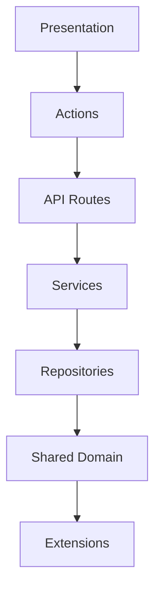

# Architecture Specification

> Generated by openlore v1.0.0 on 2026-06-22 23:25

## Purpose

This document describes the architectural patterns and structure of the system.

## Architecture Style

Layered monorepo: React SPA client → shared actions layer → HTTP API routes → service layer →
repository layer → persistence. A shared domain package bridges client and server contracts. Agent
runtime (app-agent-runtime.ts) is an additional integration hub sitting within the routes layer.

## Requirements

### Requirement: LayeredArchitecture

The system SHALL maintain separation between:
- Presentation (React SPA pages and UI components; entry points for user interaction and audience display)
- Actions (Shared client-server mutation functions for slide operations; hub for getManualSlide, updateManualSlideBlocks, assertBlockIdsExist)
- API Routes (HTTP route handlers and agent runtime; getText/runAction hubs indicate AI generation pipeline lives here)
- Services (Business logic and lifecycle management; SlideFeedbackService reads/writes source-file markers)
- Repositories (Data access and persistence; snapshot restore is an explicit entry point indicating rollback path)
- Shared Domain (Cross-boundary types, manual block presets, and API contract definitions)
- Extensions (Plugin-style extensibility layer; exact mechanism uncertain from available data)

#### Scenario: LayerSeparation
- **GIVEN** a request from the presentation layer
- **WHEN** business logic is needed
- **THEN** the presentation layer delegates to the business layer
- **AND** direct database access from presentation is prohibited

### Requirement: SecurityModel

The system SHALL implement security via: Insufficient evidence to determine auth mechanism. All feedback endpoints are scoped to :pid (presentation ID), implying presentation-level access control. No explicit auth middleware or token handling observed in the analyzed surface. Uncertain — requires inspection of route middleware.

#### Scenario: AuthenticatedAccess
- **GIVEN** an unauthenticated request
- **WHEN** accessing protected resources
- **THEN** access is denied

## System Diagram

## Layer Structure

### Presentation

**Purpose**: React SPA pages and UI components; entry points for user interaction and audience display
**Location**: `apps-slides-src-pages, apps-slides-src-components, apps-slides-src-design, apps-slides-src-slides, apps-slides-src-slides-ssh`

### Actions

**Purpose**: Shared client-server mutation functions for slide operations; hub for getManualSlide, updateManualSlideBlocks, assertBlockIdsExist
**Location**: `apps-slides-actions`

### API Routes

**Purpose**: HTTP route handlers and agent runtime; getText/runAction hubs indicate AI generation pipeline lives here
**Location**: `apps-slides-server-routes, apps-slides-server-routes/app-agent-runtime.ts`

### Services

**Purpose**: Business logic and lifecycle management; SlideFeedbackService reads/writes source-file markers
**Location**: `apps-slides-server-services`

### Repositories

**Purpose**: Data access and persistence; snapshot restore is an explicit entry point indicating rollback path
**Location**: `apps-slides-server-repositories`

### Shared Domain

**Purpose**: Cross-boundary types, manual block presets, and API contract definitions
**Location**: `apps-slides-shared, libs-api-contract`

### Extensions

**Purpose**: Plugin-style extensibility layer; exact mechanism uncertain from available data
**Location**: `apps-slides-server-routes (extension domain), apps-slides-server-services (extension domain)`

## Data Flow

Browser → SlideEditorPage/AudienceDisplayPage → actions layer (client mutations) → HTTP API routes →
service layer → repositories → persistence; AI generation path: agent runtime (getText → runAction)
→ local OpenAI-compatible provider → LocalDeckDraft → Slide entities; feedback path:
SlideFeedbackService reads/writes JSX or HTML comment markers directly in slide source files, then
syncs to persistence; snapshot/rollback: DeckSnapshot repository restore entry point reconstructs
full presentation state from immutable versioned copy

## External Integrations

| System | Purpose |
|--------|---------|
| Local OpenAI-compatible model provider (LocalModelStatus tracks runtime availability) | External integration |
| Filesystem (SlideFeedbackService mutates slide source files directly for feedback markers) | External integration |
| SSH (apps-slides-src-slides-ssh suggests SSH-connected slide variant — purpose uncertain) | External integration |
